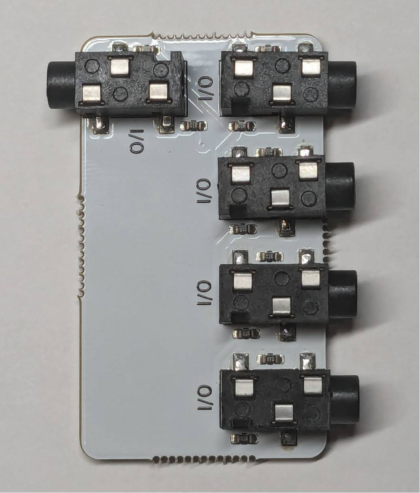
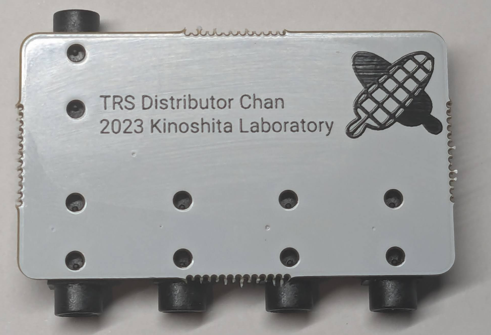
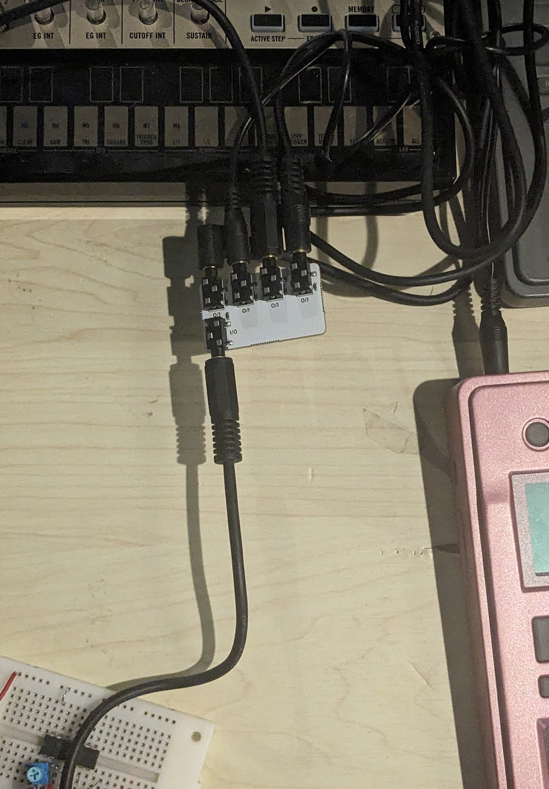

# TRS Distributor chan

[Document in Japanese](README_ja.md)

TRS Distributor chan is a passive, battery free utility PCB to distribute/merge TRS signals such as KORG sync, audio etc.
It would be useful for some situations in your musical life, for example syncing multiple devices without cascading.

## Usage

All of the I/Os are created equal.
If you input signal from one of the I/O, then it goes to all of the other I/O terminals via resistors.

If you input signals from multiple I/Os, they will be mixed you can obtain it from other terminals via resistors.
