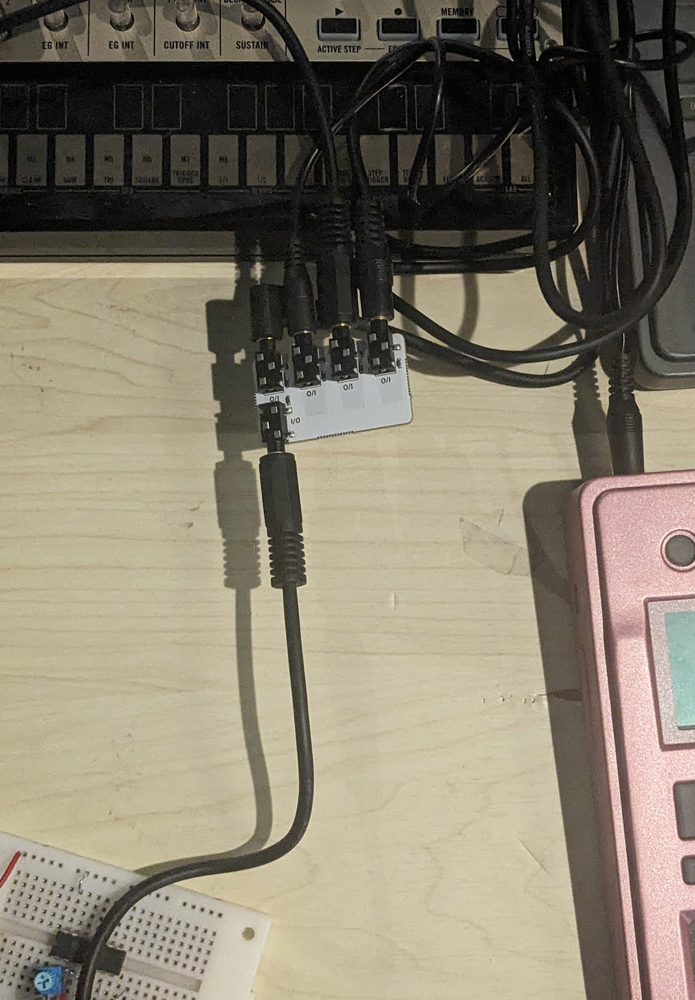

# TRS ディストリビューターちゃん

TRSディストリビューターちゃんは TRSの信号を分配したり合成したりすることができる、電源不要のパッシブ回路基板です。

Sync信号をカスケードせずに並列で使いたい時など、人生のどこかの場面で役に立つ場合があります。

## 使い方

全てのI/Oは同じように作られていて、差はありません。どこか1ヶ所から信号を入力すると、抵抗を介して他の端子に出力されます。

複数のI/Oから信号を入力すると、それらは抵抗を介してミックスされ、他の端子に出力されます。
